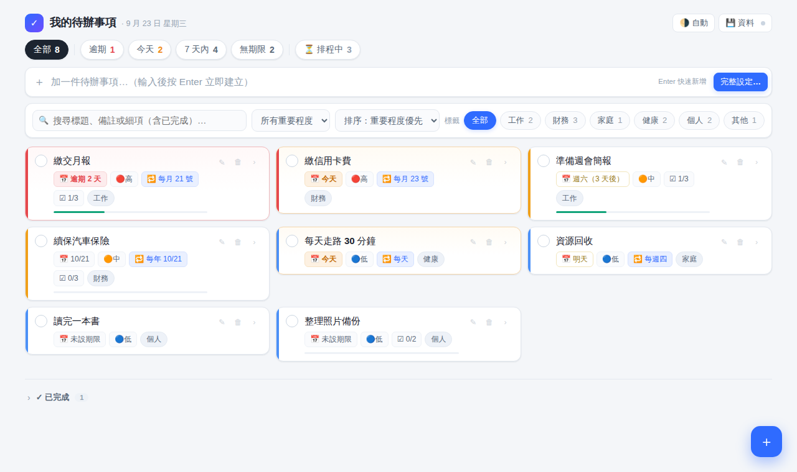
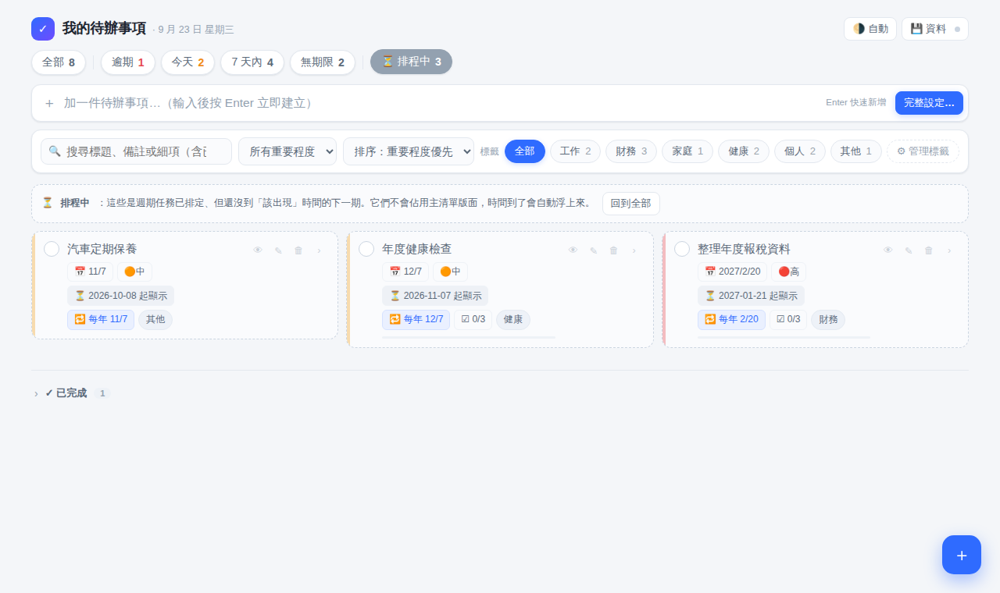
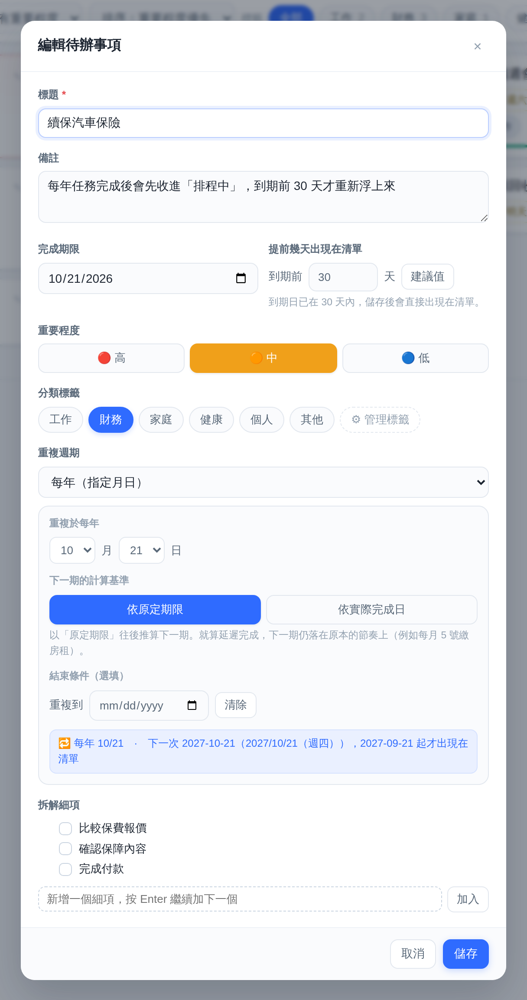
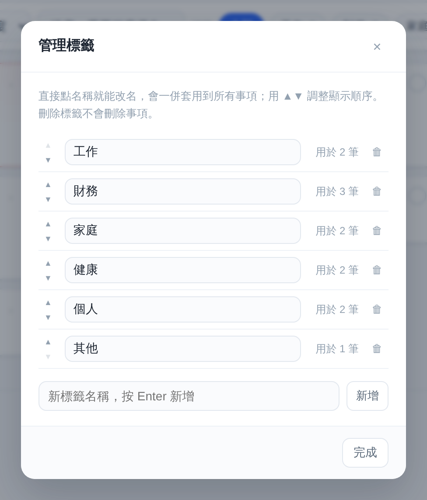
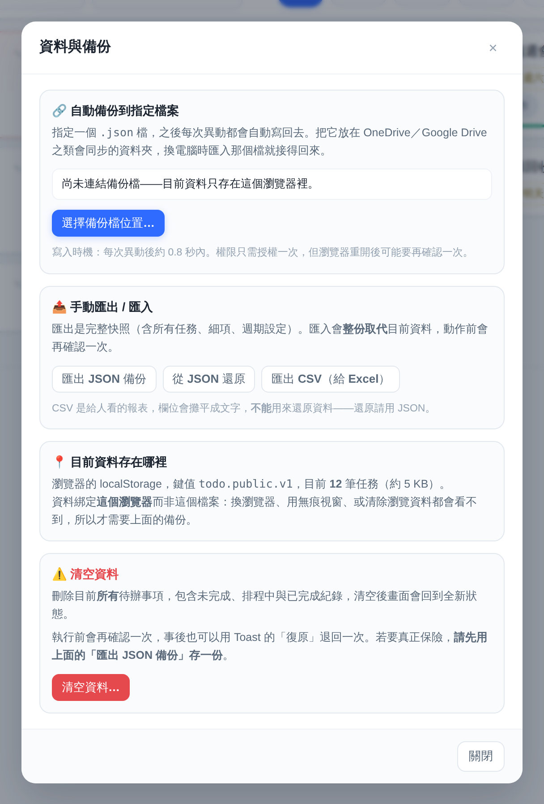
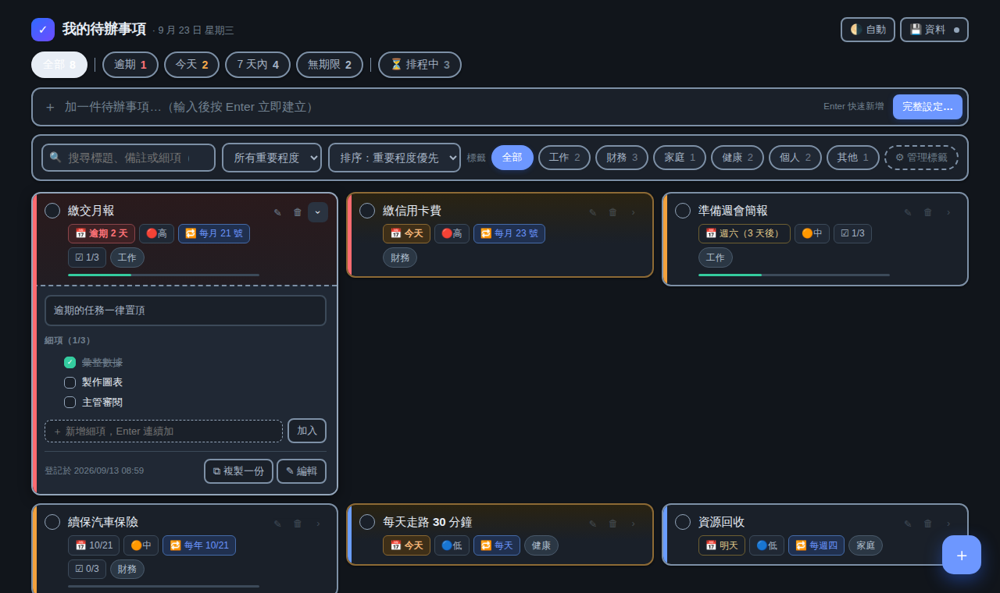

# Recurring Todo

[中文](README.md) | **English**

A personal todo list in a single HTML file. No install, no sign-up, no server — just open `index.html` in your browser.

It's built for **recurring routines**, especially the ones you only do once or twice a year but that always involve the same steps: filing taxes, renewing insurance, annual health checkups, periodic reports and filings.

**Live demo:** https://paul-codelab.github.io/recurring-todo/

> **Note:** The interface is currently in Traditional Chinese only. The feature list and screenshot captions below explain what each part does.

## Why I built this

At work I have plenty of weekly, monthly and yearly routines, and I kept running into the same problems:

- I set up a recurring reminder in Google Calendar, but by the time the notification pops up it's too late to prepare;
- I add the task to a todo app ahead of time, and then it sits there cluttering the list for a whole year;
- Or I simply forget to set it up and only remember right before the deadline.

This tool's answer is **recurrence hibernation**: when you complete a recurring task, the next occurrence is moved to a "Scheduled" area and only resurfaces on your list N days before it's due. Defaults are 0 days for daily, 3 for weekly, 7 for monthly and 30 for yearly tasks — adjustable per task.

## Features

- **Recurring tasks** — daily, weekly (pick weekdays), monthly (pick a day, including end of month) or yearly (pick month and day), with an optional end date. The next occurrence can be calculated from the original due date or from the day you actually finished.
- **Recurrence hibernation** — upcoming occurrences wait in "Scheduled" and reappear automatically when it's time, marked 🆕 so you notice them.
- **Checklists** — break any task into steps; for recurring tasks the checklist resets each cycle.
- **Status filters** — All / Overdue / Today / Next 7 days / No due date / Scheduled. Overdue tasks always stay on top.
- **Custom tags** — add, rename (applied to every task), reorder and delete. Tags are included in backups.
- **Priority and search** — search also covers completed tasks and checklist items.
- **Completed history** — see which steps you ticked last time, and repeat a task with one click.
- **Duplicate** — need to do something one extra time this year? Copy an existing task.
- **Light and dark themes**, responsive layout for desktop and mobile.

## Screenshots

**Add / edit a task** — due date, how many days ahead it should appear, priority, tags, recurrence (yearly by month and day, with the choice of calculating from the due date or the completion date) and checklist.

**Manage tags** — add, rename (applied to all tasks), reorder, delete.

**Data & backup** — link an auto-backup file, export/import JSON, export CSV, clear all data.

**Dark mode and expanded checklist** — choose auto / light / dark. Expand a card to tick off steps, duplicate or edit.

## Where your data lives

Everything is stored **only in your own browser** (localStorage). Nothing is uploaded anywhere. Because of that:

- Switching browsers or computers, or clearing browsing data, will make your tasks disappear.
- In the "💾 資料" (Data) panel you can **link an auto-backup file** (Chrome / Edge). Every change is then written to it automatically — keeping it in a synced folder such as OneDrive or Google Drive is even safer.
- You can also export/import JSON manually, or export CSV to read in Excel.

## Getting started

**Try it online:** https://paul-codelab.github.io/recurring-todo/

**Use it locally:** download `index.html` and open it in Chrome or Edge.

On first launch the app loads some sample tasks. When you're done exploring, open the "💾 資料" (Data) panel and click "清空資料" (Clear data) at the bottom to start fresh.

> **Tip:** When opened from your disk (`file://`), all local pages share the same storage. If you make your own modified copy, change the `KEY` constant in the code so the two versions don't overwrite each other's data.

## Technical notes

- A single HTML file with plain JavaScript — no dependencies, no build step, no CDN.
- Auto-backup uses the File System Access API (Chrome / Edge); the file handle is stored in IndexedDB.
- Other browsers work too, just without auto-backup — use manual export instead.

## Feedback

Suggestions and bug reports are welcome — please open an [Issue](https://github.com/paul-codelab/recurring-todo/issues).

## License

[MIT License](LICENSE)
